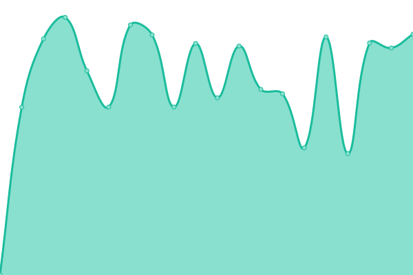

# [📈 Live Status](https://sebastian-velasquez.dev): <!--live status--> **🟩 All systems operational**

This repository contains the open-source uptime monitor and status page for [Sebastián](https://www.sebastian-velasquez.dev), powered by [Upptime](https://github.com/upptime/upptime).

With [Upptime](https://upptime.js.org), you can get your own unlimited and free uptime monitor and status page, powered entirely by a GitHub repository. We use [Issues](https://github.com/dadapunk/upptime/issues) as incident reports, [Actions](https://github.com/dadapunk/upptime/actions) as uptime monitors, and [Pages](https://sebastian-velasquez.dev) for the status page.

<!--start: status pages-->
<!-- This summary is generated by Upptime (https://github.com/upptime/upptime) -->
<!-- Do not edit this manually, your changes will be overwritten -->
<!-- prettier-ignore -->
| URL | Status | History | Response Time | Uptime |
| --- | ------ | ------- | ------------- | ------ |
|  [Personal site](https://www.sebastian-velasquez.dev) | 🟩 Up | [personal-site.yml](https://github.com/dadapunk/upptime/commits/HEAD/history/personal-site.yml) | 

 372ms
     
 | 

<a href="https://sebastian-velasquez.dev/history/personal-site">98.42%</a>
    

|  [DuckDuckGo](https://duckduckgo.com) | 🟩 Up | [duck-duck-go.yml](https://github.com/dadapunk/upptime/commits/HEAD/history/duck-duck-go.yml) | 

 86ms
     
 | 

<a href="https://sebastian-velasquez.dev/history/duck-duck-go">100.00%</a>
    

|  [Incidents Reporting Tool](https://incidents.irep-tech.com) | 🟩 Up | [incidents-reporting-tool.yml](https://github.com/dadapunk/upptime/commits/HEAD/history/incidents-reporting-tool.yml) | 

 626ms
     
 | 

<a href="https://sebastian-velasquez.dev/history/incidents-reporting-tool">100.00%</a>
    

|  [Ireport](https://irepartners.com/ireport/) | 🟩 Up | [ireport.yml](https://github.com/dadapunk/upptime/commits/HEAD/history/ireport.yml) | 

 1395ms
     
 | 

<a href="https://sebastian-velasquez.dev/history/ireport">100.00%</a>
    

<!--end: status pages-->

[**Visit our status website →**](https://sebastian-velasquez.dev)

## 📄 License

- Powered by: [Upptime](https://github.com/upptime/upptime)
- Code: [MIT](./LICENSE) © [Sebastián](https://www.sebastian-velasquez.dev)
- Data in the `./history` directory: [Open Database License](https://opendatacommons.org/licenses/odbl/1-0/)
